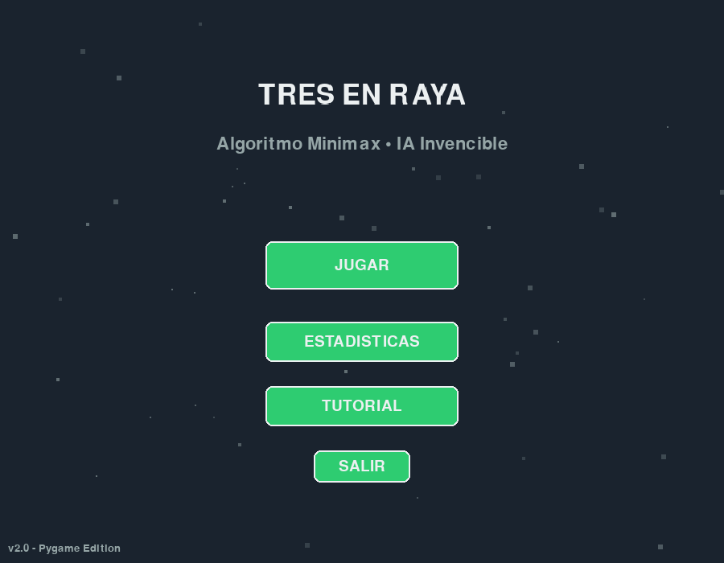
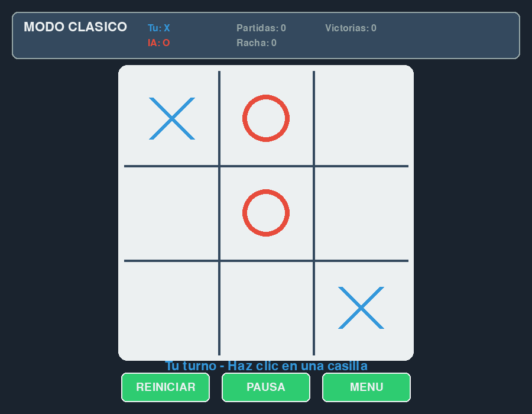
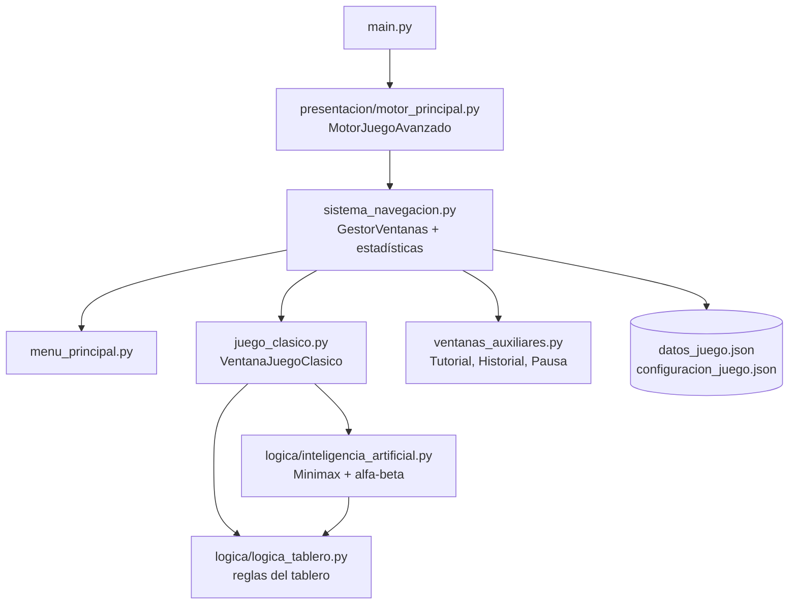

<div align="center">
  
  <h1>MinimaxXO</h1>
  <p><b>Tres en Raya con una IA Minimax + poda alfa-beta que no pierde, verificada exhaustivamente.</b></p>
  
  
  
  
  
  
  <p>
    <a href="#-inicio-rápido">Inicio rápido</a> ·
    <a href="#-características">Características</a> ·
    <a href="#-arquitectura">Arquitectura</a> ·
    <a href="#-pruebas">Pruebas</a> ·
    <a href="#-lo-que-todavía-no-existe">Limitaciones</a>
  </p>
</div>

MinimaxXO es un juego de escritorio de Tres en Raya (Pygame) donde tú juegas con `X`, mueves
primero, y la IA (`O`) responde con Minimax + poda alfa-beta sobre el árbol completo. La lógica
está separada de la interfaz, así que se prueba sin abrir ventanas. **No** hay niveles de
dificultad, multijugador ni modo en línea: la IA siempre juega al máximo.

## 🎬 Vista rápida

Capturas reales generadas con el driver de vídeo `dummy` de SDL, renderizando las ventanas del
propio juego (partida de ejemplo: X en la esquina superior izquierda y en la inferior derecha).

<div align="center">
  
  
</div>

## ✨ Características

| Característica | Detalle |
|---|---|
| IA Minimax con poda alfa-beta | `logica/inteligencia_artificial.py`; puntuación `10 - profundidad` / `profundidad - 10` (prefiere ganar antes y perder después). |
| Invencibilidad verificada | Test exhaustivo contra todas las secuencias legales del oponente: 0 derrotas en 642 partidas (73 con la IA moviendo primero, 569 moviendo segunda). |
| Interfaz Pygame | Tablero clicable, símbolos con animación de aparición y línea ganadora resaltada. |
| Menú y pantallas | Jugar, Estadísticas, Tutorial (también con `F1`), pausa e historial de partidas. |
| Estadísticas persistentes | Partidas, victorias/derrotas/empates, rachas y tiempo jugado en `datos_juego.json`; historial de las últimas 100 partidas. |
| Teclas globales | `ESC` pausa o vuelve, `F1` tutorial, `F3` contador de FPS, `F11` pantalla completa. |
| Botones en partida | REINICIAR, PAUSA y MENU. |

## 🏗️ Arquitectura



`logica/` no depende de Pygame; `presentacion/` contiene todo lo gráfico.

## 🚀 Inicio rápido

| Requisito | Versión |
|---|---|
| Python | 3.11 o 3.12 (matriz de CI); en local se probó con 3.14 usando `pygame-ce` |
| Pygame | `pygame==2.5.2` según `requirements.txt` |

```bash
git clone https://github.com/Luiss2080/MinimaxXO.git
cd MinimaxXO
pip install -r requirements.txt
python main.py
```

Elige **JUGAR**, haz clic en una casilla vacía y la IA responde sola. Contra un Minimax perfecto,
lo máximo que puedes lograr es empatar.

> Nota: `requirements.txt` fija `numpy==1.24.3`, pero el código no importa NumPy en ningún
> archivo. Con Python 3.14 la verificación se hizo con `pygame-ce` 2.5.7, no con `pygame==2.5.2`.

<details>
<summary>Estructura de carpetas</summary>

```text
main.py                     Punto de entrada
logica/                     logica_tablero.py, inteligencia_artificial.py
presentacion/               motor_principal, sistema_navegacion, menu_principal,
                            juego_clasico, ventanas_auxiliares, efectos_multimedia
tests/                      test_logica_tablero, test_estado_terminal, test_minimax_invencibilidad
datos_juego.json            Estadísticas persistentes
configuracion_juego.json    fps_objetivo, mostrar_fps, auto_guardar, modo_actual
.github/workflows/tests.yml CI con pytest (Python 3.11 y 3.12)
```

</details>

## 🧪 Pruebas

```bash
pip install pytest
pytest -v
```

La suite ejecuta **20 tests** (verificado: 20 passed) sobre la capa de lógica, sin ventana:

- Detección de victoria en las 8 líneas y de empate con tablero lleno.
- Estados terminales: la IA no calcula movimiento sobre un tablero ya decidido.
- Invencibilidad exhaustiva de la IA jugando de primera y de segunda.

Se ejecuta en GitHub Actions (`.github/workflows/tests.yml`) en cada push/PR a `main`.

## 🚧 Lo que todavía no existe

- **Las teclas `R` (reiniciar) y `M` (menú)** aparecen en la pantalla del Tutorial, pero no están
  implementadas; usa los botones REINICIAR y MENU.
- Sin niveles de dificultad, sin elegir símbolo ni quién mueve primero.
- `efectos_multimedia.py` es mínimo: solo la animación de aparición de símbolos; no hay archivos de sonido (el mezclador de audio se inicializa, pero no se reproduce nada).
- La interfaz gráfica no tiene tests automáticos (solo `logica/`).
- Dependencia `numpy` declarada pero sin uso.

## 📄 Licencia

MIT, ver [`LICENSE`](LICENSE).

<div align="center"><sub>Hecho por Luiss2080 · Python + Pygame</sub></div>
